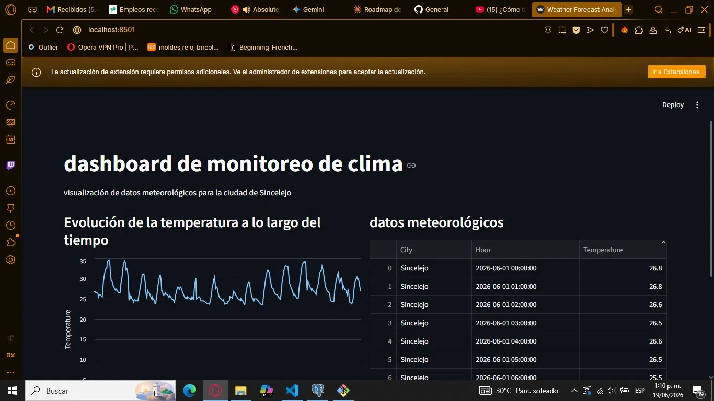

# Weather Forecast Monitor — Colombia

End-to-end ETL pipeline that pulls hourly weather forecasts for **all 1,122 municipalities of Colombia** from the Open-Meteo API, persists them in PostgreSQL, and visualizes the data with Streamlit.

Built as a portfolio project demonstrating automation mastery across DA work: extraction, validation, persistence, visualization, and scheduled execution.

---

## Demo



---

## Index

- [Why this project](#why-this-project)
- [Architecture](#architecture)
- [Stack](#stack)
- [Features](#features)
- [Installation](#installation)
- [Usage](#usage)
- [Project structure](#project-structure)
- [Roadmap](#roadmap)

---

## Why this project

Demonstrates a production-shaped data pipeline at small scale:

- Automated extraction from a public API (Open-Meteo)
- Configuration-driven coverage — switch from 6 cities to all 1,122 Colombian municipalities by changing one file
- Idempotent persistence (re-runs skip existing rows instead of failing)
- Per-row retry logic with backoff
- Interactive visualization filterable by municipality

---

## Architecture

```
┌──────────────────┐      ┌────────────┐      ┌──────────────┐      ┌──────────────┐
│  DANE MGN 2025   │      │ Extraction │      │ Persistence  │      │  Streamlit   │
│  1,122 mpios Geo │ ───▶ │  (Python)  │ ───▶ │  (Postgres)  │ ───▶ │  Dashboard   │
└──────────────────┘      └────────────┘      └──────────────┘      └──────────────┘
        │                         │                    │
        ▼                         ▼                    ▼
┌──────────────────┐      ┌────────────┐      ┌──────────────┐
│ config/colombia. │      │   Retry /  │      │   ON CONFLICT│
│       json       │      │ Rate limit │      │  DO NOTHING  │
└──────────────────┘      └────────────┘      └──────────────┘
```

**Data flow:**

1. `scripts/fetch_colombia_geojson.py` fetches the official DANE municipalities GeoJSON, computes centroids, and writes `config/colombia.json` (217KB, ~1,122 entries)
2. `forecast.py` iterates over each municipality in `config/colombia.json`, calls the Open-Meteo forecast API (7 days past + 7 days forecast, hourly), and writes rows to Postgres
3. `analizer.py` (Streamlit) reads from Postgres, lets the user pick any municipality, and renders the forecast

---

## Stack

| Layer | Tool |
|---|---|
| Language | Python 3.11+ |
| Extraction | `requests`, Open-Meteo Forecast API + Archive API |
| Geo data | DANE Marco Geoestadístico Nacional 2025 (ArcGIS REST layer 317) |
| Persistence | PostgreSQL 18 |
| Visualization | Streamlit |
| Charts | Streamlit native (`st.line_chart`) |
| Containerization | Docker (Dockerfile + image on Docker Hub optional) |
| CI / Scheduling | GitHub Actions (planned) |

---

## Features

- **1,122 Colombian municipalities** — full national coverage from a single config file
- **7 days historical + 7 days forecast** per city (336 hourly records per run)
- **Idempotent inserts** via `ON CONFLICT (city, hour) DO NOTHING` — safe to re-run
- **Per-city retry** with exponential-friendly backoff (3 attempts, 5s delay)
- **Rate limiting** (`--rate` flag, default 0.5s) to respect Open-Meteo's fair-use policy
- **Filterable Streamlit UI** — search by name or department, dropdown over 1,122 options
- **Config-driven coverage** — `--limit`, `--cities`, default = all
- **Forecast accuracy tracking** — MAE per city across temperature, sens. térmica, humidity, wind speed (T10)

---

## Installation

### Prerequisites

- Python 3.11+
- PostgreSQL 14+
- pip

### Steps

```bash
# 1. Clone the repo
git clone https://github.com/Sinlens/weather_forecast.git
cd weather_forecast

# 2. Create venv
python -m venv venv
# Windows
venv\Scripts\activate
# macOS / Linux
source venv/bin/activate

# 3. Install dependencies
pip install -r requirements.txt

# 4. Configure environment
cp .env.example .env
# Edit .env with your Postgres credentials

# 5. (Optional) Regenerate the municipalities config
python scripts/fetch_colombia_geojson.py

# 6. Apply the DB schema migration
psql -h <host> -U <user> -d <db> -f scripts/migrate_unique_city_hour.sql

# 7. Run the pipeline
python forecast.py --rate 0.2

# 8. Launch the dashboard
streamlit run analizer.py
```

Dashboard runs at `http://localhost:8501`.

---

## Usage

### CLI arguments

```bash
# Forecast pipeline (predictions)
python forecast.py                  # all 1,122 municipalities (~30 min at --rate 0.2)
python forecast.py --limit 10       # first 10 (smoke test, ~30s)
python forecast.py --cities 70001,11001   # specific DANE codes (Sincelejo, Bogotá)
python forecast.py --rate 0.3       # seconds between requests (default 0.5)

# Actual weather pipeline (observations from past days)
python actual_weather.py --days 7    # fetch 7 days of observed data (default)
python actual_weather.py --limit 5  # smoke test on 5 cities

# Accuracy computation (MAE per city per metric)
python compute_accuracy.py          # compute MAE, store in weather_accuracy
python compute_accuracy.py --city "BOGOTÁ, D.C."   # single city
```

### Useful SQL queries

```sql
-- Latest forecast per city
SELECT DISTINCT ON (city) city, hour, temperature, sens, humidity, wind_speed
FROM weather_forecast
ORDER BY city, hour DESC;

-- Cities with data coverage
SELECT city, COUNT(*) AS rows, MIN(hour) AS from_, MAX(hour) AS to_
FROM weather_forecast
GROUP BY city
ORDER BY rows DESC;

-- Latest MAE per city per metric
SELECT DISTINCT ON (city, metric) city, metric, mae, n_samples, computed_at
FROM weather_accuracy
ORDER BY city, metric, computed_at DESC;
```

### How accuracy tracking works

The pipeline computes **MAE (Mean Absolute Error)** per city per metric by JOINing `weather_forecast` (predictions) against `weather_actual` (observations from Open-Meteo Archive API) on `(city, hour)`.

**Important caveat:** Open-Meteo's `forecast` API returns observed values for `past_days=7`, not predictions made in the past. Only `forecast_days=7` values are true predictions. MAE only counts rows where `forecast_run_at < hour` — i.e., predictions made before the hour they forecast.

**What this means in practice:**

- Right after a fresh pipeline run, MAE = 0 (because no `forecast_days` hours have passed yet)
- As time runs and the pipeline re-runs (via cron, T12), MAE starts to accumulate
- For meaningful MAE numbers, the pipeline needs to run continuously for several days

**To populate MAE:**

```bash
# One-time: backfill actuals for past week
python actual_weather.py --days 7

# After a forecast run + wait + actuals run, compute MAE
python compute_accuracy.py
```

---

## Project structure

```
weather_forecast/
├── analizer.py                       # Streamlit dashboard
├── forecast.py                       # Multi-city forecast pipeline (T9)
├── actual_weather.py                 # Multi-city observed weather pipeline (T10)
├── compute_accuracy.py               # MAE computation forecast vs actual (T10)
├── requirements.txt
├── Dockerfile                        # Container build (FROM python:3.11-slim)
├── .env.example                      # Template for credentials (DB_HOST, etc.)
├── .gitignore
├── Readme.md
├── config/
│   └── colombia.json                 # 1,122 municipalities with centroids (217KB)
├── data/
│   └── raw/                          # GeoJSON cache (gitignored, regenerable)
├── docs/
│   └── preview.webp                  # Dashboard screenshot
├── scripts/
│   ├── fetch_colombia_geojson.py     # DANE → colombia.json
│   ├── migrate_unique_city_hour.sql  # UNIQUE(hour) → UNIQUE(city, hour)
│   ├── migrate_add_weather_actual.sql # weather_actual table for accuracy (T10)
│   └── migrate_add_forecast_run_at.sql # forecast_run_at column (T10)
└── pipeline.log                      # Rolling log (gitignored)
```

---

## Roadmap

### Done

- [x] Multi-city pipeline (1,122 Colombian municipalities)
- [x] Real forecast API (not archive) — aligns table semantics
- [x] Idempotent inserts via `ON CONFLICT (city, hour) DO NOTHING`
- [x] Retry loop with backoff
- [x] Config-driven coverage from official DANE source
- [x] Filterable Streamlit dashboard
- [x] Accuracy tracking infrastructure (T10): weather_actual table, MAE storage, dashboard display
  - MAE values accumulate as the pipeline runs over time (true predictions need hours to become past)

### Next (T11-T12)

- [ ] pytest scaffold + GitHub Actions CI (lint + tests on push)
- [ ] Scheduled extraction via GitHub Actions cron (every 6h)
- [ ] Streamlit Cloud public deploy

### Beyond

- [ ] Public Notion case study
- [ ] More weather variables (precipitation, UV, cloud cover)
- [ ] Anomaly detection (alert when forecast diverges from historical patterns)
- [ ] LinkedIn post showcasing the 1,122-city coverage

---

## Author

Sinlens — marioa0704@gmail.com

## License

MIT